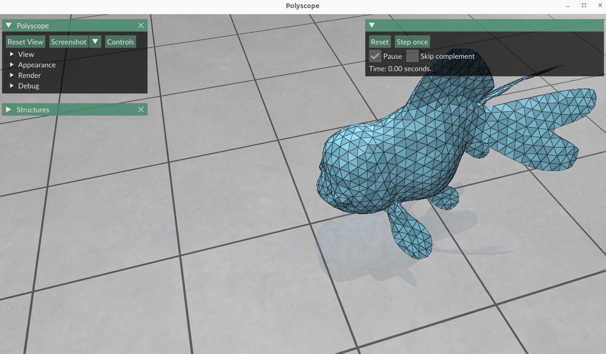
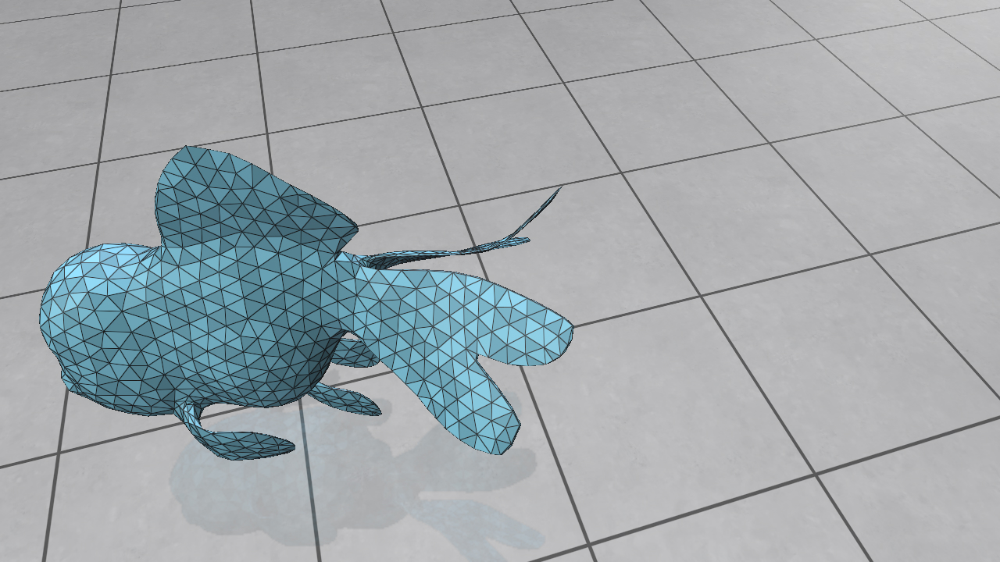
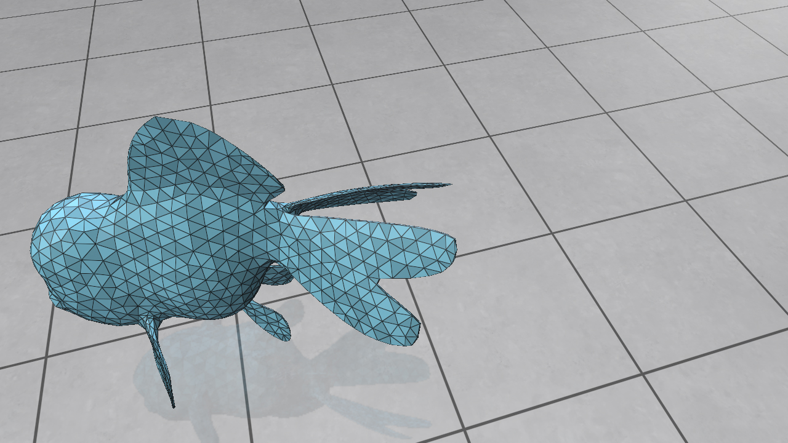

# Physics-Based Simulation Homework: Complementary Dynamics

## Environments and Dependencies
We develop and maintain this codebase in Ubuntu 22.04/24.04. The dependencies (see below) are cross-platform, so it should be relatively easy to compile the codedbase on other Ubuntu versions or operation systems (e.g., Windows/macOS). The dependencies include
- [Eigen](https://gitlab.com/libeigen/eigen.git): a C++ linear algebra library. We have already included it in this codebase as a submodule;
- [Polyscope](https://github.com/nmwsharp/polyscope): a C++/Python visualizer for 2D/3D data. We have already included in this codebase as a submodule.
- Basic C++ build toolchain: make, g++, cmake, etc. Run
```
sudo apt-get install build-essential
```
if you do not have them on your computer.

## Installation Guide
- Use git to clone the codebase:
```
git clone --recursive https://github.com/taodu-eecs/phys_sim_complementary_dynamics.git
```
- Run **from the root folder (the folder that contains this README.md file)** `./build.sh` to compile the code and run the main program. If everything goes well, a window like the screenshot below will pop up:

The layout of these panels may differ on your computer.

If you encounter compilation or runtime errors, check [Polyscope's building guide](https://polyscope.run/building/) and [Eigen's guide](https://eigen.tuxfamily.org/dox/GettingStarted.html) first. Contact our teaching assistant if you still cannot resolve the issue.

## Programming Tasks
This homework invites you to code up core algorithms in [Complementary Dynamics](https://www.dgp.toronto.edu/projects/complementary-dynamics/), and we have marked them with a `TODO` label in the given framework. Most of them require only a few lines of C++ code, and we suggest you read the lecture slides and the comments before the `TODO` labels carefully before you start. If you have trouble finishing them, we encourage you to come and visit us during our office hours.

### Task 1 (6 points): Elastic materials
This task asks you to implement the corotated material described in Section 3.4 of the [SIGGRAPH course notes by Sifakis and Barbic](https://viterbi-web.usc.edu/~jbarbic/femdefo/sifakis-courseNotes-TheoryAndDiscretization.pdf). The related classes are `Material` and `CorotatedMaterial` in `cpp/material`.
- Task 1.1 (2 points): finish the implementation of `CorotatedMaterial::Psi`, the energy density function, in `cpp/src/corotated_material.cpp`.
- Task 1.2 (2 points): implement `CorotatedMaterial::P`, the stress tensor, in `cpp/src/corotated_material.cpp`.
- Task 1.3 (2 points): finally, implement `CorotatedMaterial::dPdF`, the Jacobian of the stress tensor with respect to the deformation gradient, in `cpp/src/corotated_material.cpp`. Note that this function has two versions, and the other version has already implemented the stress differential for your reference, which you can use freely in your implementation.

### Task 2 (9 points): Elastic forces and the stiffness matrix
This task asks you to compute the elastic force and assemble the stiffness matrix from hyperelastic materials. Read the `Simulator` class in `cpp/sim`, figure out the meaning of each data member, and implement the following functions:
- Task 2.1 (2 points): implement `Simulator::E` in `cpp/sim/src/simulator_basic.cpp`. This function computes the strain energy for a given configuration of vertices `q`. It may be helpful to read the constructor of `Simulator` before your start.
- Task 2.2 (3 points): implement `Simulator::fe` in `cpp/sim/src/simulator_basic.cpp`. This function computes the elastic force and should be the negative gradient of `Simulator::E`.
- Task 2.3 (4 points): finally, implement the stiffness matrix (the Hessian of `Simulator::E`) in `Simulator::K` in `cpp/sim/src/simulator_basic.cpp`. Construct it as a sparse matrix by collecting nonzero entries from each finite element.
- Task 2.4 (0 points): `Simulator` has provided a `CheckElastics` function to help you finish Tasks 2.2 and 2.3. Read this function and figure out how to use it to test the correctness of your Tasks 2.2 and 2.3 implementations. You do not need to submit anything for Task 2.4. However, if your solution cannot pass `CheckElastics`, it is very likely that your implementations contain a bug.

### Task 3 (5 points): Complementary dynamics
We are now ready to fill in the blanks in complementary dynamics. Read the lecture slides or [the original paper](https://www.dgp.toronto.edu/projects/complementary-dynamics/) to understand its details before you start the tasks below.
- Task 3.1 (2 points): read the `LinearBlendSkinningRig` class in `cpp/rig` and implement `LinearBlendSkinningRig::ur` in `cpp/rig/src/linear_blend_skinning_rig.cpp`. This function computes the user-specified displacement ($u_t^r$ in Eq. 1 of the paper).

Once your implementation is ready, run `./build.sh` and click `Skip complement`, then unclick `Pause` to run the simulator without complementary dynamics. The motion of the fish is now completely kinematic and follows the linear-blend skinning method you just implemented. We have provided a video `asset/doc/video_no_complementary.mp4` for your reference:
<video controls>
    <source src="asset/doc/video_no_complementary.mp4" type="video/mp4">
</video>

- Task 3.2 (3 points): finally, read `Simulator::Step` in `cpp/sim/src/simulator_step.cpp` carefully and implement the linear solve step in Newton's iteration for complementary dynamics. You may use the linear solvers for [dense systems](https://eigen.tuxfamily.org/dox/group__TutorialLinearAlgebra.html) and [sparse systems](https://eigen.tuxfamily.org/dox/group__TopicSparseSystems.html) in Eigen as you see fit, or even code up your own solver if you want.

After finishing all tasks, run `./build.sh` and unclick `Pause` to run the simulator with complementary dynamics. The two pictures below show the last frame of simulation with and without complementary dynamics for your reference. Note the secondary motions from the pectoral and caudal fins with complementary dynamics.



We have also provided a video `asset/doc/video_complementary.mp4` for you to check the correctness of your implementation.

### Bonus (0 points)
We encourage you to add more features to the current framework. A few possible extensions to the current framework include:
- Speed up the simulation with parallel programming on GPUs. For example, assemble the stiffness matrix in parallel or implement a parallel conjugate gradient (CG) solver in Newton iterations.
- Add more elastic models, e.g., as-rigid-as-possible ([ARAP](https://igl.ethz.ch/projects/ARAP/arap_web.pdf)) or [projective dynamics](https://www.projectivedynamics.org/Projective_Dynamics/index.html).
- Implement other rigging methods besides linear-blend skinning as described in Sec. 3.4 of [complementary dynamics](https://www.dgp.toronto.edu/projects/complementary-dynamics/comp-dynamics-low-res.pdf).
- Add collision detection and contact handling.

## Submission Guide
Create a folder `submission` that includes the following files:
```
submission/:
- corotated_material.cpp
- linear_blend_skinning_rig.cpp
- simulator_basic.cpp
- simulator_step.cpp
```
Compress the folder into `submission.zip` and submit it to [Web Learning](https://learn.tsinghua.edu.cn/). You can run
```
./submit.sh
```
to automate this process (Read `./submit.sh` for details). **It is your responsibility to double check** that your `submission.zip` contains the correct source code files with your implementation. Email `submission.zip` to taodu@tsinghua.edu.cn or our Teaching Assistant if you miss the deadline but still have late days left. We do not accept submissions in any other formats.

We won't grade bonus implementations, but you are more than welcome to discuss them with the teaching staff during our office hours or explore them in your course project.

## Acknowledgments
The user interface is based on the [codebase](https://github.com/siggraphcontact/rigidBodyTutorial) from the [SIGGRAPH'22 Course on Contact and Friction Simulation for Computer Graphics](https://siggraphcontact.github.io/). The fish mesh is obtained from the [Complementary Dynamics](https://www.dgp.toronto.edu/projects/complementary-dynamics/) paper.